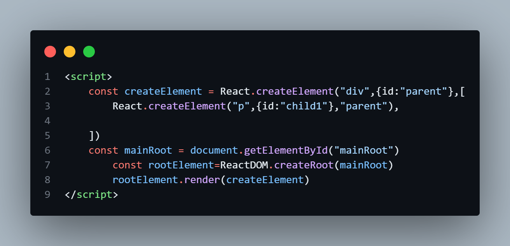

**1.** **What is React?**
> React is a JavaScript library that's your best friend when it comes to building cool user interfaces (UIs) for web applications. It is a tool for building UI components.

**2.** **Who made React?**
> React, a JavaScript library for building user interfaces, was developed by Facebook. It was initially created by Jordan Walke, a software engineer at Facebook, and was first deployed on Facebook's newsfeed in 2011. 

**3.** **What is Babel?**
> Babel is a JavaScript compiler that can translate markup or programming languages into JavaScript.
With Babel, you can use the newest features of JavaScript (ES6 - ECMAScript 2015).
Babel is available for different conversions. React uses Babel to convert JSX into JavaScript.

**4.** **How does Babel convert html code in React into valid code?**
> Babel is primarily a JavaScript compiler, and it is commonly used in the React ecosystem to transform modern JavaScript code (including JSX syntax used in React) into a version of JavaScript that is compatible with a wide range of browsers.

**5.** **What is ReactDOM used for? Write an example?**
> ReactDOM is a package in the React library that provides DOM-specific methods for working with React elements. It's primarily responsible for rendering React components to the DOM (Document Object Model). Here's a simple example to illustrate how ReactDOM is used:

**6.** **What are the packages that you need to import for react to work with?**
> *To work with React, you typically need to import the following core packages:*
1.React: The React package is the fundamental library for building user interfaces with React. It provides the necessary functions and methods for creating React components
.2 ReactDom: The ReactDOM package provides methods for interacting with the DOM, allowing you to render React components into the actual browser DOM.

**7.** **How do you add react to a web application?**
> If you want a quick setup with sensible defaults, you can use Create React App:
**.** npx create-react-app my-react-app
**.** cd my-react-app
If you are not using Create React App, you need to install the react and react-dom packages:
**.** npm install react react-dom

**8.** **What is React.createElement?**
> React Elements: This method doesn’t directly create a DOM element. Instead, it describes what the UI should look like using these elements.

**9.** **What are the three properties that createElement accept?**
> const element = React.createElement("div", {
        className: "container",
        children: "Hello World",
      })
    React.createElement is doing three main things:
	  1. Specifies the type of element ("div")
	  2. Adds any properties to that element (like className)
      3. Sets the children of that element ("Hello world")

**10.** **What is the meaning of render and root?**
> .1 Render: "Render" refers to the process of converting React components into a format that can be displayed on the screen.
.2 Root: In the context of a web application, "root" usually refers to the root DOM element where your React application is mounted.